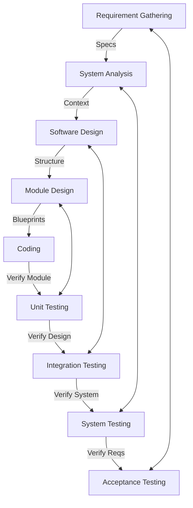

# Ariadne

Ariadne is an autonomous software lifecycle engine implementing the V-Model. It orchestrates AI agents to convert tickets from Plane into fully documented, tested, and version-controlled software using standard Git.

The core philosophy is Dual-Gate Verification: No artifact moves to the next phase until it has been explicitly reviewed and approved by both an AI Auditor and a Human Operator.

## Technology Stack

- **Project Management:** Plane (Source of Truth for Tasks)
- **Documentation & Analysis:** MkDocs (Markdown)
- **Design:** Mermaid.js (Diagrams-as-Code)
- **Version Control:** Git (Standard local/remote workflows)
- **Testing:** Pytest (Unit/Integration) & Cucumber (Acceptance)
- **Interface:** Textual (Terminal User Interface - TUI)

## The V-Model Workflow

Ariadne strictly follows the phases defined in the system architecture:



## Installation

### 1. Setup Environment
```bash
git clone https://github.com/your-org/ariadne.git
cd ariadne
python -m venv .venv
# Windows:
.\.venv\Scripts\activate
# Linux/macOS:
source .venv/bin/activate
pip install -r requirements.txt
```

### 2. Initialize Configuration
Initialize the local configuration folder.
```bash
python src/configuration/init_config.py
```
This will create an `.ariadne/.env` file. You should edit this file to configure your local setup (e.g., pointing to your self-hosted `PLANE_API_URL` and `PLANE_WS_SLUG`). 

*Note: For security reasons, do **not** put API keys in this file. Ariadne uses a secure system Vault for secrets.*

## Usage: The Terminal UI (TUI)

Ariadne operates entirely through an advanced, interactive Terminal UI.

To launch the engine:
```bash
python ariadne.py tui
```

### Managing Secrets
The first time you run Ariadne, you must configure your API keys. Ariadne stores these securely in your operating system's native keychain (Vault), rather than relying on insecure `.env` text files.

Inside the TUI, use the `/secret` command:
```text
/secret PLANE_API_TOKEN <your_plane_token>
/secret LLM_API_KEY <your_gemini_or_openai_key>
```
*Optional: You can also specify unique keys for individual agents (e.g., `/secret PO_AGENT_API_KEY ...`). If not set, they will fall back to the main keys.*

### Selecting Agents
Ariadne utilizes specialized agents for different phases of the V-Model. You can switch the active agent based on the task you need performed:
```text
/agent "Product Owner"  # Manages the backlog
/agent "Requirements"   # Refines tickets into specs
/agent "Architect"      # Designs the system architecture
/agent "Developer"      # Writes the code
/agent "Tester"         # Writes the test suite
```

### Executing Tasks
Once an agent is selected, you simply converse with it:
```text
> Please implement the authentication logic defined in Ticket-102.
```
The agent will autonomously read the ticket, execute the necessary bash/git commands, modify the code, and ask for your approval via the Dual-Gate Verification system before making any permanent commits or marking tickets as completed.