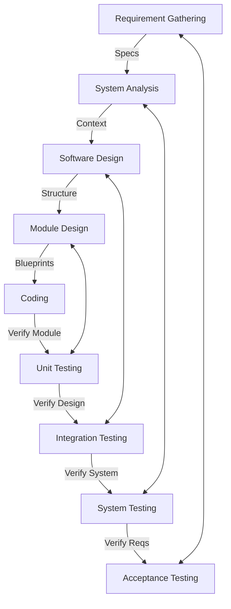

# Ariadne

Ariadne is an autonomous software lifecycle engine implementing the V-Model. It orchestrates AI agents to convert tickets from Plane into fully documented, tested, and version-controlled software using standard Git.

The core philosophy is Dual-Gate Verification: No artifact moves to the next phase until it has been explicitly reviewed and approved by both an AI Auditor and a Human Operator.

## Technology Stack

- **Project Management:** Plane (Source of Truth for Tasks)
- **Documentation & Analysis:** MkDocs (Markdown)
- **Design:** Mermaid.js (Diagrams-as-Code)
- **Version Control:** Git (Standard local/remote workflows)
- **Testing:** Pytest (Unit/Integration) & Cucumber (Acceptance)

## The V-Model Workflow

Ariadne strictly follows the phases defined in the system architecture:



## The Dual-Gate Review System

Every phase requires two signatures to proceed:
1. **AI Audit:** Checks consistency and traceability.
2. **Human Sign-off:** Manual approval via CLI.

## Installation

### Setup Environment
```bash
git clone https://github.com/your-org/ariadne.git
cd ariadne
python -m venv venv
# Windows:
.\venv\Scripts\activate
# Linux/macOS:
source venv/bin/activate
pip install -r requirements.txt
```

### Setup Local Plane & Configuration
Ariadne includes automation to set up your local development environment.

1.  **Initialize Configuration:**
    Create your local configuration folder (ignored by git).
    ```bash
    python src/init_config.py
    ```
    This creates `.config/.env`. You can edit this file to change the `PLANE_URL` or `LLM_BACKEND`.

2.  **Start Plane:**
    Initialize and start the local Plane Docker instance (listening on port 8090).
    ```bash
    python src/setup_plane.py
    ```
    Wait ~60 seconds for migrations to finish, then access Plane at `http://localhost:8090`.

3.  **API Key Management:**
    You **do not** need to manually paste your API key. Ariadne automatically retrieves the "Main access token" from the `.plane/secret-key-*.csv` file generated by Plane.

### Configuration
Local overrides can be placed in `.config/.env`:
```ini
PLANE_URL=http://localhost:8090
LLM_BACKEND=ollama
```

## Execution Lifecycle (Phase by Phase)

### 1. Verification Phase (Left Side)

#### Step 1: Requirement Gathering
**Goal:** Define user needs.
- **Input:** Plane Ticket.
- **Output:** `docs/requirements/REQ-001.md`.

```bash
python ariadne.py phase gather --ticket TICKET-101
# Review Loop:
python ariadne.py review --human --approve --file docs/requirements/REQ-001.md
```

#### Step 2: System Analysis
**Goal:** Refine requirements into system specifications.
- **Input:** Requirements.
- **Output:** `docs/analysis/SPEC-001.md` (Functional specs, API definitions).

```bash
python ariadne.py phase analysis --ticket TICKET-101
```

#### Step 3: Software Design
**Goal:** High-level architecture.
- **Input:** System Specs.
- **Output:** `docs/design/ARCH-001.md` (Mermaid Sequence/Component Diagrams).

```bash
python ariadne.py phase software-design --ticket TICKET-101
```

#### Step 4: Module Design
**Goal:** Low-level logic definitions.
- **Input:** Architecture.
- **Output:** `docs/design/MODULE-001.md` (Class diagrams, Function signatures, Pseudo-code).

```bash
python ariadne.py phase module-design --ticket TICKET-101
```

### 2. Coding Phase (The Vertex)

**Goal:** Implementation based on Module Design.
- **Input:** Module Specs.
- **Output:** Python Source Code (`src/`).

```bash
python ariadne.py phase code --ticket TICKET-101
```

**Git Action:** After dual-approval, the tool automatically stages files:
```bash
git add src/ docs/
git commit -m "Feat(TICKET-101): Implemented module logic"
```

### 3. Validation Phase (Right Side)

#### Step 5: Unit Testing
**Goal:** Validate Module Design.
- **Action:** Tests individual functions/classes in isolation.

```bash
python ariadne.py phase unit-test --ticket TICKET-101
# Runs pytest on specific modules
```

#### Step 6: Integration Testing
**Goal:** Validate Software Design.
- **Action:** Tests interaction between modules (e.g., API calling Database).

```bash
python ariadne.py phase integration-test --ticket TICKET-101
```

#### Step 7: System Testing
**Goal:** Validate System Analysis.
- **Action:** End-to-end testing of the complete flow.

```bash
python ariadne.py phase system-test --ticket TICKET-101
```

#### Step 8: Acceptance Testing
**Goal:** Validate Requirement Gathering.
- **Action:** Runs Cucumber (Gherkin) features against the user requirements.

```bash
python ariadne.py phase acceptance --ticket TICKET-101
```

## Finalization

Once the V-Model is fully traversed (Acceptance Tests passed):
```bash
python ariadne.py complete --ticket TICKET-101
```
- Updates `traceability.lock`.
- Executes `git push origin main`.
- Marks Plane ticket as Done.
