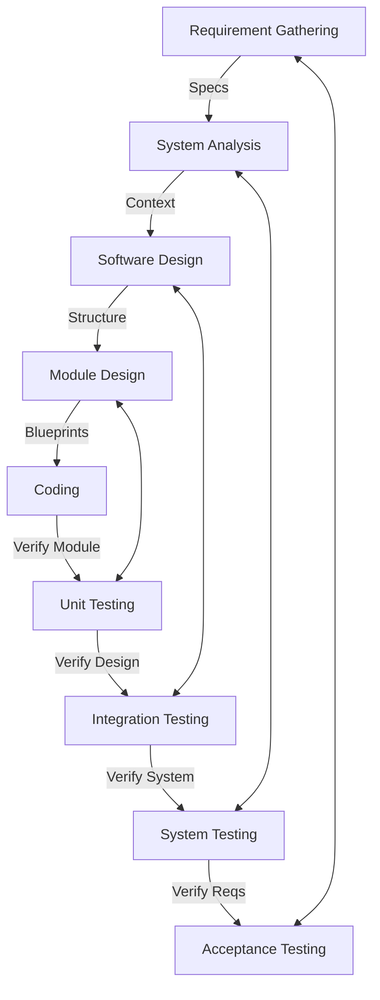

# Ariadne

Ariadne is an autonomous software lifecycle engine implementing the V-Model. It orchestrates AI agents to convert tickets from a local SQLite database into fully documented, tested, and version-controlled software using standard Git.

The core philosophy is Dual-Gate Verification: No artifact moves to the next phase until it has been explicitly reviewed and approved by both an AI Auditor and a Human Operator.

## Technology Stack

- **Project Management:** Local SQLite Database (Source of Truth for Tasks)
- **Documentation & Analysis:** MkDocs (Markdown)
- **Design:** Mermaid.js (Diagrams-as-Code)
- **Version Control:** Git (Standard local/remote workflows)
- **Testing:** Pytest (Unit/Integration) & Cucumber (Acceptance)
- **Interface:** Textual (Terminal User Interface - TUI)

## The V-Model Workflow

Ariadne strictly follows the phases defined in the system architecture:



## Installation

### pip

Install from a local checkout:
```bash
git clone https://github.com/your-org/ariadne.git
cd ariadne
python -m pip install .
```

For development:
```bash
python -m pip install -e ".[dev]"
```

After installation, use the console command:
```bash
ariadne init
ariadne tui
```

### Arch Linux / pacman

Build and install a self-contained local pacman package:
```bash
git clone https://github.com/your-org/ariadne.git
cd ariadne/packaging/arch
makepkg -si
```

This builds from the local git checkout, installs Ariadne into `/opt/ariadne-lifecycle`, and creates `/usr/bin/ariadne`. Python dependencies are installed into Ariadne's private virtual environment during package build, so this does not require AUR Python packages and does not install into Arch's system Python.

If you do not want a pacman package, use a virtual environment instead of system pip:
```bash
python -m venv .venv
source .venv/bin/activate
python -m pip install .
```

### Manual Development Environment
```bash
git clone https://github.com/your-org/ariadne.git
cd ariadne
python -m venv .venv
# Windows:
.\.venv\Scripts\activate
# Linux/macOS:
source .venv/bin/activate
pip install -r requirements.txt
```

### Initialize Configuration
Initialize the local configuration folder.
```bash
ariadne init
```
This will create an `.ariadne/user_settings.json` file where you can configure your LLM backend and other preferences.

*Note: For security reasons, API keys are NOT stored in files. Ariadne uses a secure system Vault for secrets.*

## Usage: The Terminal UI (TUI)

Ariadne operates entirely through an advanced, interactive Terminal UI.

To launch the engine:
```bash
ariadne tui
```

### Managing Secrets
The first time you run Ariadne, you must configure your API keys. Ariadne stores these securely in your operating system's native keychain (Vault), rather than relying on insecure `.env` text files.

Inside the TUI, use the `/secret` command:
```text
/secret LLM_API_KEY <your_gemini_or_openai_key>
```
### Ticket Management (CLI)
Ariadne provides simple CLI commands to manage your local tickets:
```bash
ariadne list-tickets       # List all tickets in a table
ariadne get-ticket <ID>    # Show full details of a ticket
```

### Selecting Agents
Ariadne utilizes specialized agents for different phases of the V-Model. You can switch the active agent based on the task you need performed:
```text
/agent "Orchestrator"   # Manages the backlog and coordinates workflow
/agent "Requirements"   # Refines tickets into specs
/agent "Architect"      # Designs the system architecture
/agent "Developer"      # Writes the code
/agent "Tester"         # Writes the test suite
```

### Executing Tasks
Once an agent is selected, you simply converse with it:
```text
> Please implement the authentication logic defined in Ticket-1.
```
The agent will autonomously read the ticket, execute the necessary bash/git commands, modify the code, and ask for your approval via the Dual-Gate Verification system before making any permanent commits or marking tickets as completed.
