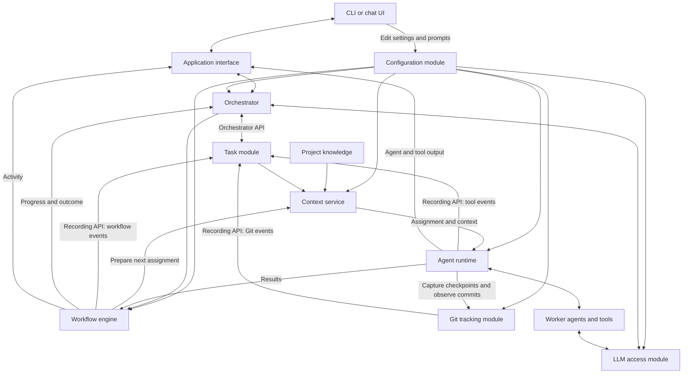

# Ariadne: Architecture Overview

```mermaid
flowchart TD
    CLI[CLI or chat UI] <--> I[Application interface]
    I <--> O[Orchestrator]
    CLI -->|Edit settings and prompts| Config[Configuration module]
    Config --> O
    Config --> W
    Config --> C
    Config --> R
    Config --> G
    Config --> L[LLM access module]
    O <--> L
    A <--> L
    O <-->|Orchestrator API| T[Task module]
    O --> W[Workflow engine]
    W -->|Prepare next assignment| C[Context service]
    R <--> A[Worker agents and tools]
    R -->|Recording API: tool events| T
    R -->|Capture checkpoints and observe commits| G[Git tracking module]
    G -->|Recording API: Git events| T
    W -->|Recording API: workflow events| T
    K[Project knowledge] --> C
    T --> C
    C -->|Assignment and context| R[Agent runtime]
    R -->|Results| W
    W -->|Progress and outcome| O
    W -->|Activity| I
    R -->|Agent and tool output| I
    click T href "modules/task-module.md" "Open task module details" _self
    click Config href "modules/configuration-module.md" "Open configuration module details" _self
    click G href "modules/git-tracking-module.md" "Open Git tracking module details" _self
    click L href "modules/llm-module.md" "Open LLM access module details" _self
    click I href "modules/interaction-module.md" "Open application interface details" _self
    click O href "modules/orchestrator-module.md" "Open orchestrator and chat details" _self
```
