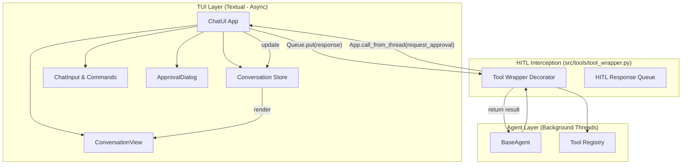
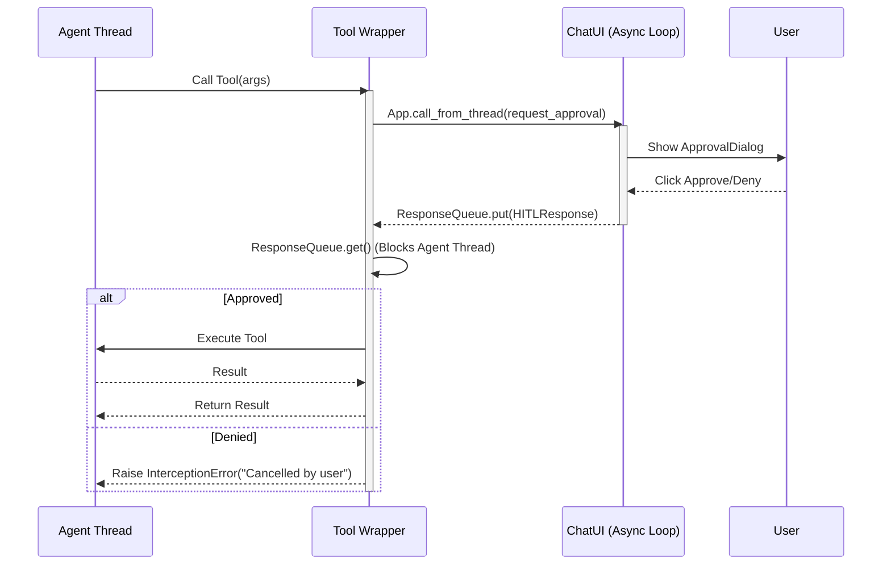

# ARCH-15: Terminal User Interface & Human-in-the-loop

**Traceability:**
- **Originating Ticket:** #15
- **Refinement Tickets:** #19
- **Requirement Link:** docs/requirements/REQ-15.md

## 1. Overview
This architecture defines the Terminal User Interface (TUI) and Human-in-the-loop (HITL) mechanism for the autonomous agent system. The TUI provides real-time monitoring, multi-agent control, and a command interface using the Textual framework. The HITL mechanism ensures that sensitive tool calls are intercepted and approved by the user before execution. A key focus of this architecture is testability, enabling automated UI testing and headless execution as per FR-13 to FR-17.

## 2. Component Design / Data Models

### 2.1 TUI Components (Textual)
All interactive components MUST have unique, stable `id` attributes to facilitate targeted selection in automated UI tests (FR-14).

- **ChatUI (App):** The root application container. Manages global state, message routing, and the event loop.
    - `id`: `chat-app`
    - **Fields:**
        - `active_agent_id: str`
        - `conversation_history: List[Message]`
        - `is_waiting_for_hitl: bool`
    - **Testability Hooks:**
        - `get_state() -> Dict[str, Any]`: Returns a dictionary of the current UI state. (FR-13)
        - `simulate_keypress(key: str)`: Triggers key events programmatically. (FR-15)
        - `simulate_input(text: str)`: Injects text into the input buffer. (FR-15)
- **ConversationView (ScrollableContainer):** Displays message history.
    - `id`: `conversation-view`
- **BotResponseWidget (Static):** Represents an agent response turn.
    - `id`: `bot-response-{uuid}`
- **StatusWidget (Static):** Visual indicator for tool execution.
    - `id`: `status-widget-{tool_call_id}`
- **ApprovalDialog (Container):** Modal overlay for HITL.
    - `id`: `approval-dialog`
    - **Buttons:** `approve-btn`, `deny-btn`, `allow-session-btn`, `modify-btn`.
    - **Input:** `args-editor` (TextArea for modifying tool arguments).
- **ChatInput (Container):**
    - `id`: `chat-input-container`
    - `ChatTextArea` (id: `chat-input-text`)

### 2.2 Diagrams
#### 2.2.1 Component Interaction Diagram


### 2.3 Data Models & Schemas

#### Message
```python
class Message:
    id: str  # Unique message UUID
    sender: str  # "user" | agent_id
    content: str  # Text content of the message
    timestamp: float  # Unix timestamp
    type: str  # "text" | "tool_call" | "tool_result"
```

#### ToolCall
```python
class ToolCall:
    id: str  # Unique tool call UUID
    tool_name: str  # Name of the tool being called
    args: Dict[str, Any]  # Arguments passed to the tool
    status: str  # "pending" | "running" | "success" | "error" | "cancelled"
    result: Optional[str]  # String representation of the tool output
```

#### HITLRequest
```python
class HITLRequest:
    request_id: str  # Unique ID for this specific HITL interaction
    tool_name: str  # Name of the tool requiring approval
    args: Dict[str, Any]  # Proposed arguments
    timestamp: float  # When the request was created
```

#### HITLResponse
```python
class HITLResponse:
    request_id: str  # Must match HITLRequest.request_id
    action: str  # "approve" | "deny" | "session" | "modify"
    modified_args: Optional[Dict[str, Any]]  # New arguments if action is "modify"
    timestamp: float  # When the response was provided
```

#### get_state() Schema
```python
{
    "active_agent": str, # ID of the active agent
    "is_modal_active": bool, # True if a dialog (like ApprovalDialog) is open
    "modal_type": Optional[str], # "approval" | "settings" | None
    "last_tool_call": Optional[str], # Name of the most recent tool called
    "message_count": int, # Total number of messages in the current conversation
    "current_input_buffer": str # Current text in the ChatInput
}
```

## 3. Integration Points / API Contract

### 3.1 HITL Interception Sequence
The TUI coordinates synchronous tool calls from background threads with its asynchronous event loop.



### 3.2 Thread Safety Audit
- **TUI Updates:** All UI updates from background threads (e.g., tool logs) MUST use `App.call_from_thread()` or `App.post_message()`. Directly modifying widget state from a thread will cause a `RuntimeError` in Textual.
- **HITL Synchronization:** The communication from TUI to the blocked agent thread MUST use a thread-safe `queue.Queue` or `threading.Event`.
- **Global State:** Any shared state (e.g., `session_wide_approval` flag) MUST be protected by a `threading.Lock` if accessed from both the UI loop and agent threads.

### 3.3 Automated Testing & Observability
- **Headless Mode:** The TUI MUST support execution via `run_test` (Textual) to allow assertions without a physical terminal (FR-16).
- **Transition Hooks:** `ChatUI` MUST provide internal hooks (e.g., `_on_test_event(event_name, data)`) that tests can use to wait for specific UI transitions like "modal_opened" or "message_received" (FR-17).

## 4. Validation Rules / Constraints
- **ID Stability:** `id` attributes for widgets MUST remain constant across versions to prevent breaking automated tests. (FR-14)
- **Developer Hand-off Constraint:** "How will a Developer Agent break this?" -> They might forget to use `call_from_thread` when updating the UI from a tool callback. **Constraint:** Any function intended to be called from a background thread to update the UI MUST be explicitly decorated or prefixed with `threadsafe_`.
- **HITL Timeout:** A 5-minute timeout MUST be implemented for user response; defaults to "Deny" to prevent hanging the agent indefinitely.
- **JSON Validation:** In the "Modify" interface, the TUI MUST validate that the edited arguments are valid JSON and match the expected tool schema before sending the response back to the wrapper.
- **Audit Integrity:** All HITL decisions (Approve/Deny/Modify) MUST be logged to the agent's audit trail before the tool execution proceeds or is cancelled (FR-12).
